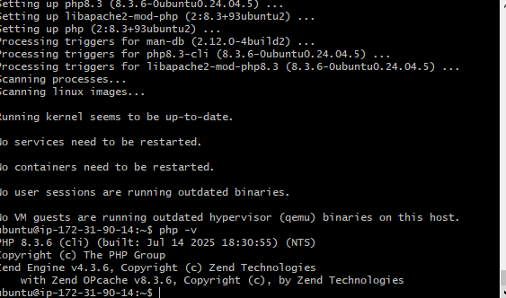
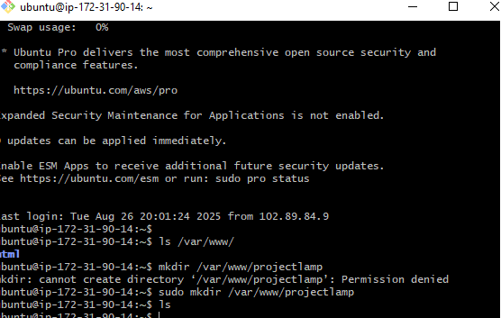
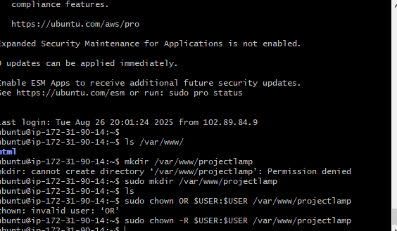
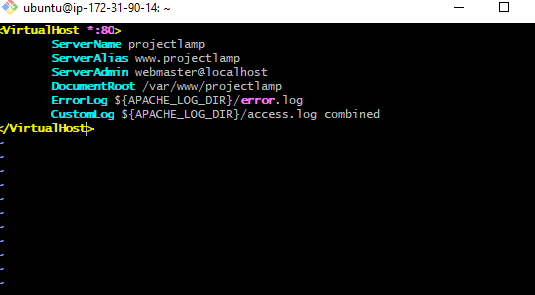
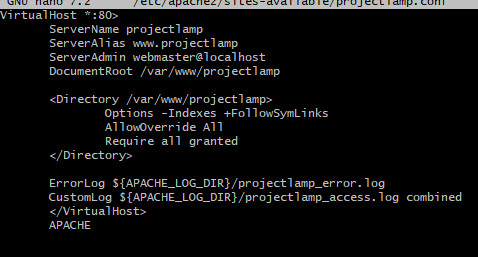
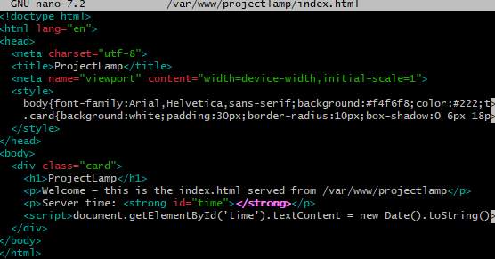
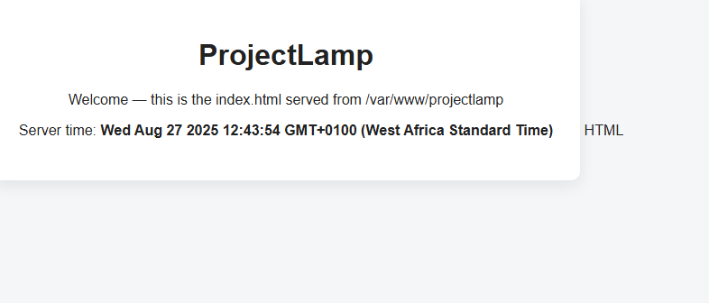

# AWS LAMPSTACK   
This project is to use LAMP Stack to set-up and configure the following: 
A. Linux server - Ubuntu
B. Apache for  Web server (http)
C. MySql - Database
D. Php - for dynamic pages
## 1. Creating AWS Instance
1. I created an Instacne in AWS and named it Ubuntu-LAMP
2. I chose Ubuntu from list of servers
3. The configuration is 24.04 amd noble, 64-bit, t2.micro free tier, 8 Gig storage
4. I opened http, https and ssh ports and allowed traffic from anywhere
5. I created a .pem key to connect to the server 
    
## Connecting to AWS Instance (Ubuntu Server)
1. I run ssh command to connect to the server using the public ip address  
 

## Installing Appache Web server
1. I updated the list of packages in the package manager using (apt update)

2. I installed apache server using the systemctl install 
3. I enabled apache2 after installation using systemctl enable
4. I started apache2 using systemctl start
5. I checked apache2 status using systemctl status  
  
6. I connect to the apache server through localhost using curl command
7. I connect to the apache server using 127.0.0.1:80
  
8. I coonect to the appache through web browser
   

### Installing MySQL Server
I need to install MySQL in order to be able to store and manage data in RDS
1. I installed Mysql server using the sudo apt install
   
2. I enable Mysql using systemctl enable command
3. I started Mysql using systemctl start command
4. I checked Mysql status using systemctl command 
   
5. I logged into Mysql using sudo mysql command
6. I set password for root user using mysql_native_password command
7. I secure Mysql using mysql_secure_installation
8. I set a strong password for Mysql
9. I logged into Mysql using root password created

### Installing PHP
PHP is the component of the LAMP Stack that will enable the server to display dynamic content.
Three packages are needed to be installed.
- php
- libapache2-mod-php
- php-mysql

1. I installed the packages using sudo apt command
2. I cheked the php version with -v command  
   

### Creating a Virtual Host
1. I created a new directory in the webhost folder and named it 'projectlamp' which will serve as my domain  
   
2. I assigned owner to the domain using user environment variable - chown -R $USER:$USER command
  
3. I created and configure a new file in Apache's sites-available directory using the nano command
  

4. I created index.html in the projectlamp folder and put some code using nano command
   
5. I used a2ensite command to enable the virtual host
6. I ran a2dissite command to disable default index.html to avoid confusion
7. I used apache2ctl configtest command to check for syntax errors
8. I used systemctl reload apache2 command to ensure all changes take effect
9. I tested my projectlamp index.html page in browser and it displayed well
[Visit Projectlamp](http://35.172.134.31)
