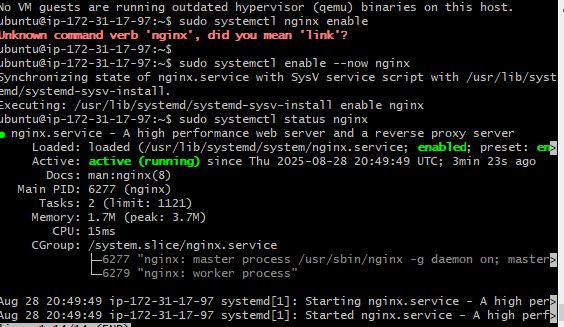
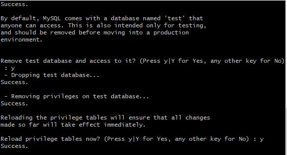

# AWS LEMP STACK ON AWS EC2 
This project is to use LEMP Stack to set-up and configure the following: 
A. Linux server - Ubuntu
B. Nginx for  Web server (http)
C. MySql - Database
D. Php - for dynamic pages
## 1. Creating AWS Instance
1. I created an Instacne in AWS and named it Ubuntu-LAMP
2. I chose Ubuntu from list of servers
3. The configuration is 24.04 amd noble, 64-bit, t2.micro free tier, 8 Gig storage
4. I opened http and ssh ports; and allowed traffic from anywhere
5. I created a .pem key to connect to the server 

## Connecting to AWS Instance (Ubuntu Server)
1. I run ssh-i command to connect to the server using the public ip address 

## Installing Nginx Web server
In order to serve web pages to visitors I will install Nginx which is a high performing web server
1. I updated and upgrade the list of packages in the package manager using (sudo apt update && sudo apt upgrade)
   
2. I installed Nginx server using the sudo apt install 
  
3. I enabled Nginx after installation using systemctl enable
4. I connect to the apache server through localhost using curl command

5. I connect to the Nginx server using 127.0.0.1:80

6. I connect to the Nginx server through web browser  

### Installing MySQL Server
I need to install MySQL in order to be able to store and manage data on my website
1. I installed Mysql server using the sudo apt install
2. I enable Mysql using systemctl enable command
3. I started Mysql using systemctl start command
4. I checked Mysql status using systemctl command   

5. I logged into Mysql using sudo mysql command  

  
6. I set password for root user using mysql_native_password command

  

8. I secured Mysql using mysql_secure_installation
  

9. I set a strong password for Mysql  
10.  I logged into Mysql using root password created  

  

### Installing PHP
PHP is the component of the LEMP Stack that will enable the server to serve dynamic contents on the website.
These two packages are needed to be installed on Nginx server.
- php-fpm
- php-mysql

1. I installed the packages using sudo apt command
2. I cheked the php version with -v command  
  
3. I checked php-fpm status using systemctl status command  
  

### Configuring Nginx to Use PHP Processor
1. I created a new directory in /var/www and named it 'projectLEMP' which will serve as my domain   
     

2. I assigned owner to the domain using user environment variable - chown -R $USER:$USER command    
3. I created and configure a new file in Nginx's sites-available directory using the nano command  
  

4. I activated and linked /etc/nginx/sites-available to /etc/nginx/sites-enabled  
  

5. I ran sudo nginx -t to test for error  
  

6. I disabled default nginx host and reload nginx to apply changes  
7. I created index.php in projectLEMP folder and put some code in it using sudo nano command  
  

8. I created index.html in the projectLEMP folder and put some code using nano command  
  

9.  I reordered the index files in sites-available directory to fetch .php first   
   

10. I used systemctl reload nginx command to ensure all changes take effect    
11. I tested my projectLEMP index.html page in browser and it displayed well  
         
 

12.  I tested projectLEMP index.php (default) in browser and it worked  
    
 
 

