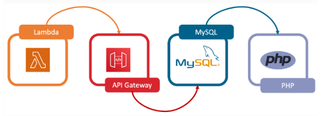

# SDLC
The Software Development Life Cycle (SDLC) is a structured process used by development teams to plan, design, build, test, and deploy high-quality software. It provides a framework for managing the entire software development process, from initial concept to final product, ensuring projects are completed efficiently and effectively. 
Here's a breakdown of the typical phases involved in an SDLC:
1. Requirement Gathering and Analysis:
Defining the project's goals, scope, and specific requirements from stakeholders. 
2. Software Design:
Creating a blueprint for the software, including architecture, data models, and user interfaces. 
3. Coding and Implementation:
The actual development of the software based on the design specifications. 
4. Testing:
Evaluating the software to identify and fix bugs, ensuring it meets quality standards. 
5. Deployment:
Making the software available to users, whether through a website, app store, or other platform. 
6. Maintenance:
Ongoing support and updates to the software, including bug fixes, performance enhancements, and new features. 
The SDLC provides a structured approach to software development, helping teams manage risks, maintain quality, improve efficiency, and ensure compliance with regulations. There are various SDLC models, such as Waterfall, Agile, and Spiral, each with its own approach to managing the development process according to Xygeni. 
## What is SDLC?
The software development lifecycle (SDLC) is the cost-effective and time-efficient process that development teams use to design and build high-quality software. The goal of SDLC is to minimize project risks through forward planning so that software meets customer expectations during production and beyond. This methodology outlines a series of steps that divide the software development process into tasks you can assign, complete, and measure.
## Why is SDLC important?
Software development can be challenging to manage due to changing requirements, technology upgrades, and cross-functional collaboration. The software development lifecycle (SDLC) methodology provides a systematic management framework with specific deliverables at every stage of the software development process. As a result, all stakeholders agree on software development goals and requirements upfront and also have a plan to achieve those goals.
## Here are some benefits of SDLC:
1.  Increased visibility of the development process for all stakeholders involved
2. Efficient estimation, planning, and scheduling
3. Improved risk management and cost estimation
4. Systematic software delivery and better customer satisfaction
## How does SDLC work?
The software development lifecycle (SDLC) outlines several tasks required to build a software application. The development process goes through several stages as developers add new features and fix bugs in the software.  

The details of the SDLC process vary for different teams. However, we outline some common SDLC phases below.
## Plan
The planning phase typically includes tasks like cost-benefit analysis, scheduling, resource estimation, and allocation. The development team collects requirements from several stakeholders such as customers, internal and external experts, and managers to create a software requirement specification document.
The document sets expectations and defines common goals that aid in project planning. The team estimates costs, creates a schedule, and has a detailed plan to achieve their goals.
## Design
In the design phase, software engineers analyze requirements and identify the best solutions to create the software. For example, they may consider integrating pre-existing modules, make technology choices, and identify development tools.   They will look at how to best integrate the new software into any existing IT infrastructure the organization may have.
## Implement
In the implementation phase, the development team codes the product. They analyze the requirements to identify smaller coding tasks they can do daily to achieve the final result.
## Test
The development team combines automation and manual testing to check the software for bugs. Quality analysis includes testing the software for errors and checking if it meets customer requirements. Because many teams immediately test the code they write, the testing phase often runs parallel to the development phase.
## Deploy
When teams develop software, they code and test on a different copy of the software than the one that the users have access to. The software that customers use is called production, while other copies are said to be in the build environment, or testing environment.

Having separate build and production environments ensures that customers can continue to use the software even while it is being changed or upgraded. The deployment phase includes several tasks to move the latest build copy to the production environment, such as packaging, environment configuration, and installation.
## Maintain
In the maintenance phase, among other tasks, the team fixes bugs, resolves customer issues, and manages software changes. In addition, the team monitors overall system performance, security, and user experience to identify new ways to improve the existing software.
## What are SDLC models?
A software development lifecycle (SDLC) model conceptually presents SDLC in an organized fashion to help organizations implement it. Different models arrange the SDLC phases in varying chronological order to optimize the development cycle. We look at some popular SDLC models below.
## Waterfall
The waterfall model arranges all the phases sequentially so that each new phase depends on the outcome of the previous phase. Conceptually, the design flows from one phase down to the next, like that of a waterfall.
### Pros and cons
The waterfall model provides discipline to project management and gives a tangible output at the end of each phase. However, there is little room for change once a phase is considered complete, as changes can affect the software's delivery time, cost, and quality. Therefore, the model is most suitable for small software development projects, where tasks are easy to arrange and manage and requirements can be pre-defined accurately.
## Iterative
The iterative process suggests that teams begin software development with a small subset of requirements. Then, they iteratively enhance versions over time until the complete software is ready for production. The team produces a new software version at the end of each iteration.

### Pros and cons
It’s easy to identify and manage risks, as requirements can change between iterations. However, repeated cycles could lead to scope change and underestimation of resources.
## Spiral
The spiral model combines the iterative model's small repeated cycles with the waterfall model's linear sequential flow to prioritize risk analysis. You can use the spiral model to ensure software's gradual release and improvement by building prototypes at each phase.
### Pros and cons
The spiral model is suitable for large and complex projects that require frequent changes. However, it can be expensive for smaller projects with a limited scope.
## Agile
The agile model arranges the SDLC phases into several development cycles. The team iterates through the phases rapidly, delivering only small, incremental software changes in each cycle. They continuously evaluate requirements, plans, and results so that they can respond quickly to change. The agile model is both iterative and incremental, making it more efficient than other process models.

### Pros and cons
Rapid development cycles help teams identify and address issues in complex projects early on and before they become significant problems. They can also engage customers and stakeholders to obtain feedback throughout the project lifecycle. However, overreliance on customer feedback could lead to excessive scope changes or end the project midway.
## How does SDLC address security?
In traditional software development, security testing was a separate process from the software development lifecycle (SDLC). The security team discovered security flaws only after they had built the software. This led to a high number of bugs that remained hidden as well as increased security risks.

Today, most teams recognize that security is an integral part of the software development lifecycle. You can address security in SDLC following DevSecOps practices and conducting security assessments during the entire SDLC process.
## DevSecOps
**DevSecOps** is the practice of integrating security testing at every stage of the software development process. It includes tools and processes that encourage collaboration between developers, security specialists, and operation teams to build software that can withstand modern threats. In addition, it ensures that security assurance activities such as code review, architecture analysis, and penetration testing are integral to development efforts.
### How does SDLC compare with other lifecycle management methodologies?
The term software development lifecycle (SDLC) is frequently used in technology to refer to the entire process of technology innovation and support. We give other similar terms below.
### Systems development lifecycle
The abbreviation SDLC can sometimes refer to the systems development lifecycle, the process for planning and creating an IT system. The system typically consists of several hardware and software components that work together to perform complex functions.
### Software development lifecycle compared to systems development lifecycle
The software development lifecycle addresses only the development and testing of software components. On the other hand, system development is a broader superset involving the setup and management of the software, hardware, people, and processes that can make up a system. It can include tasks like organizational training and change management policies that don’t fall under the software development umbrella.
## Application lifecycle management
***Application lifecycle management*** (ALM) is the creation and maintenance of software applications until they are no longer required. It involves multiple processes, tools, and people working together to manage every lifecycle aspect, such as ideation, design and development, testing, production, support, and eventual redundancy.
## SDLC compared to ALM
**SDLC** describes the application development phase in greater detail. It is a part of ALM. ALM includes the entire lifecycle of the application and continues beyond SDLC. ALM can have multiple SDLCs during an application's lifecycle.

## LAMP STACK
A LAMP stack is a popular open-source software bundle used for building and deploying web applications. It's an acronym for Linux, Apache, MySQL, and PHP (or Perl/Python). The stack provides a foundation for creating dynamic websites and web applications by combining the functionalities of these four components.

### Here's a breakdown of each component: 
## Linux:
The operating system, providing the base environment for the other components.
## Apache:
A web server that handles requests from users (web browsers) and serves web pages.
## MySQL:
A database management system that stores and manages data for the application.
## PHP (or Perl/Python):
A server-side scripting language that generates dynamic content for web pages, interacts with the database, and handles user input.  
The LAMP stack is widely used due to its open-source nature, making it a cost-effective solution for web development. Many popular web applications like WordPress and Drupal utilize the LAMP stack. 

### What is a LAMP stack?
A LAMP stack is a bundle of four different software technologies that developers use to build websites and web applications. LAMP is an acronym for the operating system, Linux; the web server, Apache; the database server, MySQL; and the programming language, PHP. All four of these technologies are open source, which means they are community maintained and freely available for anyone to use. Developers use LAMP stacks to create, host, and maintain web content. It is a popular solution that powers many of the websites you commonly use today.
### Why is a LAMP stack important?
Web developers choose a LAMP stack to build web applications for the following reasons. 
### Cost
All LAMP technologies are open source, which means that any developer or company can use them without having to pay licensing fees. Instead of purchasing proprietary stack components, you can download the operating system, web server, database, and scripting language for free. This lowers the cost of building web applications.
### Efficiency
Setting up a new web development stack requires rigorous testing of different frameworks, modules, libraries, and tools. On the other hand, a LAMP stack is a tried-and-tested web development solution. Web developers can prioritize and speed up application development to focus on what they are building instead of how they are building it.
### Maintenance
Software experts from around the globe contribute to the development of LAMP stack technologies by changing, commenting on, and reviewing the publicly available source codes. They regularly maintain and update the technologies so that they remain relevant and secure. 
### Support
Popular open-source technologies, such as LAMP stacks, have the support of a large, global IT community. Hence, LAMP stack users can more easily find information on public IT forums. Web developers can refer to example codes or use tested plugins created by the open-source community. 
### Flexibility
A LAMP stack gives both reliability and flexibility to web developers. While the LAMP architecture specifies the software components for each layer, developers can replace them as they see fit. For example, they can use another operating system besides Linux as the stack foundation.
### What is a LAMP stack used for?
A LAMP stack is used for backend or server-side development. A backend application is software that runs in an environment that’s hidden from end users. Backend applications consist of the following:
1. Data processing software 
2. Database components
3. Business logic in code 
4. API for communicating with other applications  
    
The webpage that shows up on your browser is called the frontend application. When you interact with the page, such as by clicking on a button, your browser communicates with the backend application to retrieve the required information.
Developers use a LAMP stack to create both static and dynamic web content.
### Static webpages 
Static webpage information from the web server is the same for all users. For example, the address on a company's website is static content. Web developers create static webpages with HTML and CSS programming languages and store them as files in the web server application. 
### Dynamic webpages 
Dynamic webpages contain information that changes depending on the user viewing the webpage or web application. For example, a website message that changes based on your location is dynamic content. The web server delivers dynamic websites by processing business logic or retrieving data from a database.
 

### What is the LAMP architecture?
A software stack is a set of layered tools, libraries, programming languages, and technologies used for building, managing, and running an application. The stack consists of software components that support the application in different ways, such as visual presentation, database, networking, and security.   
Similarly, the LAMP architecture consists of four software technologies that work together behind the scenes to create a working web application. It describes how each of these web development technologies interact with each other in a computer server. __The LAMP architecture consists of the following layers.__
### Linux
__Linux__ is an open-source operating system that you can install and configure to meet different application requirements. Linux sits at the first level of the LAMP stack and supports other components on the upper layers.

### Apache
__Apache__ is an open-source web server that forms the second layer of the LAMP stack. The Apache module stores website files and exchanges information with a browser using HTTP, an internet protocol for transferring website information in plain text. For example, when a browser requests a webpage, the Apache HTTP server does the following:
- Receives the request
- Processes the request and finds the required page file
- Sends the relevant information back to the browser
### MySQL
**MySQL** is an open-source relational database management system and is the third layer of the LAMP stack. The LAMP model uses MySQL for storing, managing, and querying information in relational databases. For example, developers store application data, such as customer records, sales, and inventories. When a user searches for information, the web server queries the stored data in MySQL. Query refers to special instructions for manipulating data in a relational database with the SQL language.
### PHP
**PHP**, which stands for PHP: Hypertext Preprocessor, is the fourth and final layer of the LAMP stack. It is a scripting language that allows websites to run dynamic processes. A dynamic process involves information in software that constantly changes. Web developers embed the PHP programming language in HTML to show real-time or updated information on websites. They use PHP to allow the web server, database, and operating system to cohesively process requests from browsers. 
### HTML compared to PHP
Web developers use HTML for frontend development, such as designing the layout of webpages. Meanwhile, they use PHP to determine the behavior of certain components when users load a webpage. For example, web developers design the graphical layout of an online product catalog with HTML. They then use PHP code to retrieve the latest product price from the backend server.
### How does a LAMP stack work?
Web applications use a LAMP stack to respond to requests from web browsers. The Apache web server and MySQL database run on the Linux operating system and communicate using PHP. When you open a webpage in a browser, the LAMP stack goes through the following process.
- Receives requests: 
The Apache web server receives the incoming request from the browser. If the request is to load a static file, the Apache server responds directly with the appropriate content. If the request is for dynamic content, the Apache server passes the request to the PHP component. The PHP component finds and loads the appropriate PHP file that can process the request.

- Processes requests: 
The PHP file contains PHP functions that are codes for generating dynamic content. The PHP component processes the PHP functions, such as converting measurement units or creating a sales chart. Some PHP functions might require information from the database. In such cases, the PHP code retrieves the stored information from the database and uses it to process the function. 
- Returns responses:
The PHP passes the calculated results to the web server in HTML format. At the same time, it also stores new data in the MySQL database. The Apache HTTP server sends the dynamic HTML results to the user's browser. 
### What are LAMP alternatives?
LAMP alternatives, or LAMP variants, are backend development technologies that use different components than those specified in the LAMP architecture. For example, web developers might use other web servers instead of Apache to receive and process requests from frontend applications. Some LAMP alternatives might use proprietary components, such as licensed operating systems. 
### Alternative scripting languages
While PHP is the default scripting language of the LAMP stack, developers can replace it with Perl or Python. 
### Perl 
Perl is a programming language that has been around for more than 30 years. Developers use Perl for web development because it works well with database integration and has frameworks that help with development. Frameworks are software tools that contain well-tested components that speed up application development.
### Python
Python is a high-level programming language for building different types of software, including web applications. Developers use Python in web development because it’s simple and easy to understand.

## MEAN STACK
What is a MEAN stack?
MEAN is an acronym for MongoDB, Express.js, Angular.js, and Node.js. It is an alternative to LAMP and is built on JavaScript technologies. JavaScript is a programming language for backend and frontend development. The following are the roles of the MEAN stack components:
#### MongoDB is a database that works well with JSON, a type of JavaScript for reading data.
#### Express.js is a framework that provides open-source tools for building backend applications.
#### Node.js is a platform that runs JavaScript applications.
#### Angular.js is an open-source framework for developing frontend applications.
### MEAN stack compared to LAMP stack
MEAN and LAMP stacks are great open-source software stacks for different types of web applications. A MEAN stack is suitable for web applications that involve heavy logic processing on the frontend. Meanwhile, a LAMP stack is great for large-scale complex websites that handle heavy traffic. For example, developers use a MEAN stack to build a video-streaming web application but choose a LAMP stack for an ecommerce web application

## CHMOD
**chmod** is a command in Unix and Unix-like operating systems (such as Linux) that stands for "change mode." It is used to modify the file system permissions of files and directories. These permissions determine who can read, write, or execute a file or access the contents of a directory.
Key concepts related to chmod:
### Permissions:
There are three basic types of permissions:
- Read (r): Allows viewing the contents of a file or listing the contents of a directory.
- Write (w): Allows modifying or deleting a file, or creating/deleting files within a directory.
- Execute (x): Allows running a file (if it's an executable program or script) or accessing a directory (e.g., changing into it).
### User Classes:
Permissions are applied to different user classes:
- User (u): The owner of the file or directory.
- Group (g): Users who belong to the same group as the file or directory.
- Other (o): All other users on the system.
- All (a): Refers to all user classes (user, group, and other).
### Modes:
Permissions can be specified using either symbolic mode (using letters like r, w, x, u, g, o, a) or numeric (octal) mode (using numbers like 755, 644).  

Example of chmod usage (numeric mode):
Code
chmod 755 myfile.sh

This command sets the permissions of myfile.sh as follows:
- Owner (7): Read, Write, and Execute (4+2+1).
- Group (5): Read and Execute (4+1).
- Other (5): Read and Execute (4+1).  

Example of chmod usage (symbolic mode):  
Code  
chmod u+x script.py  
This command adds execute permission (+x) for the user (u) to the file script.py.  
chmod is a fundamental tool for managing file access control and ensuring the security and proper functioning of a system in a multi-user environment.

### Setting File Permissions:
The "chmod" command modifies the read, write, and execute permissions of specified files and the search permissions of specified directories.
 
The format for the command is as shown below:
           	chmod [who] permission file
 
[who] refers to who you are giving permissions to.
Specified in the order:  user, group, others.  
The permissions that can be given are : read, write or execute.  
The Octal digits used for assigning permissions are as follows:  

| Octal Digit      | Permissions      | 3-CharacterPros                          |                          |
|------------|--------------|-------------------------------|-------------------------------|
| 7  | read, write, execute   | rwx|
| 6  | read, write     | rw-      | 
| 5     | read, execute  | r-x                |
| 4      | read  | r--       | 
|3      |write, execute     |-wx
|2      |write      |-w-
|1      |execute        |--x
|0      |none       |---

  
Example:  
### $ chmod 711 .file  
This command will give read, write, execute permissions to the user (owner), execute permission to the group and execute permission to others.  

### $ chmod 644 .plan  
sets the permissions for the file .plan as
-rw-r--r--
meaning that the user has permission to read and write and everyone else has read-only permission.  
Another way to give permissions is:  

Example:

### $ chmod g+r .plan
 
This command adds (hence '+')  read permissions to the group for the file .plan.
You can also use multiple abbreviations within the chmod syntax to add or subtract multiple permissions within one single command line.  
 For example:  
### $ chmod ugo+rwx .plan   
This command gives read, write, and execute permissions to the user (owner), the group, and all others
Viewing File permissions:
You can view the permissions by using the command
	ls -la  
This lists the files with the permissions assigned to them.

### Chown Command in Linux 

The chown command allows you to change the user and/or group ownership of a given file, directory, or symbolic link.
In Linux, all files are associated with an owner and a group and assigned with permission access rights for the file owner, the group members, and others.
This tutorial will show you how to use the chown command through practical examples.
How to Use chown
Before going into how to use the chown command, let’s start by reviewing the basic syntax.  

The chown command expressions take the following form:  
chown [OPTIONS] USER[:GROUP] FILE(s)

Copy  
USER is the user name or the user ID (UID) of the new owner.  

 GROUP is the new group’s name or the group ID (GID).  
  FILE(s) is the name of one or more files, directories, or links. Numeric IDs should be prefixed with the + symbol.  

USER - If only the user is specified, the specified user will become the owner of the given files. The group ownership is not changed.  

USER: - When the username is followed by a colon :, and the group name is not given, the user will become the owner of the files, and the files group ownership is changed to the user’s login group.  

USER:GROUP - If both the user and the group are specified (with no space between them), the user ownership of the files is changed to the given user and the group ownership is changed to the given group.  

:GROUP - If the User is omitted and the group is prefixed with a colon :, only the group ownership of the files is changed to the given group.  

: If only a colon : is given, without specifying the user and the group, no change is made.
By default, chown doesn’t produce any output on success and returns zero.  

To find out who owns a file or what group the file belongs to, use the ls -l command:
ls -l filename.txt  

Copy
-rw-r--r-- 12 linuxize users 12.0K Apr  8 20:51 filename.txt
|[-][-][-]-   [------] [---]
                |       |
                |       +-----------> Group
                +-------------------> Owner

Copy  

Regular users can change the file group only if they own the file and only to a group they are a member of. Administrative users can change the group ownership of all files.  

### How to Change the Owner of a File
To change the owner of a file, use the chown command followed by the user name of the new owner and the target file as an argument:
chown USER FILE

For example, the following command will change the ownership of a file named file1 to a new owner named linuxize:
chown linuxize file1

To change the ownership of multiple files or directories, specify them as a space-separated list. The command below changes the ownership of a file named file1 and directory dir1 to a new owner named linuxize:
chown linuxize file1 dir1

The numeric user ID (UID) can be used instead of the username. The following example will change the ownership of a file named file2 to a new owner with a UID of 1000:
chown 1000 file2

If a numeric owner exists as a user name, the ownership will be transferred to the user name. To avoid this, prefix the ID with +:
chown 1000 file2

How to Change the Owner and Group of a File
To change both the owner and the group of a file use the chown command followed by the new owner and group separated by a colon (:) with no intervening spaces and the target file.
chown USER:GROUP FILE

The following command will change the ownership of a file named file1 to a new owner named linuxize and group users:
chown linuxize:users file1

If you omit the group name after the colon (:), the group of the file is changed to the specified user’s login group:
chown linuxize: file1

How to Change the Group of a File
To change only the group of a file, use the chown command followed by a colon (:) and the new group name (with no space between them) and the target file as an argument:
chown :GROUP FILE

The following command will change the owning group of a file named file1 to www-data:
chown :www-data file1

Another command you can use to change the group ownership of files is chgrp .
How to Change Symbolic Links Ownership
When the recursive option is not used, the chown command changes the group ownership of the files to which the symlinks point, not the symbolic links themselves.  
For example, if you try to change the owner and the group of the symbolic link symlink1 that points to /var/www/file1, chown will change the ownership of the file or directory the symlink points to:
chown www-data: symlink1

Chances are that instead of changing the target ownership, you will get a “cannot dereference ‘symlink1’: Permission denied” error.
The error occurs because, by default, on most Linux distributions, symlinks are protected, and you cannot operate on target files.   
This option is specified in /proc/sys/fs/protected_symlinks. 1 means enabled, and 0 is disabled. We recommend not to disable the symlink protection.
To change the group ownership of the symlink itself, use the -h option:
chown -h www-data symlink1

How to Recursively Change the File Ownership
To recursively operate on all files and directories under the given directory, use the -R (--recursive) option:
chown -R USER:GROUP DIRECTORY

The following example will change the ownership of all files and subdirectories under the /var/www directory to a new owner and group named www-data:
chown -R www-data: /var/www

If the directory contains symbolic links, pass the -h option:
chown -hR www-data: /var/www

Other options that can be used when recursively changing the directory ownership are -H and -L.
If the argument passed to the chown command is a symbolic link that points to a directory, the -H option will cause the command to traverse it. -L tells chown to traverse each symbolic link to a directory that is encountered.  

Usually, you should not use these options because you might mess up your system or create a security risk.  

### Using a Reference File  
The --reference=ref_file option allows you to change the user and group ownership of given files to be the same as those of the specified reference file (ref_file). If the reference file is a symbolic link, chown will use the user and group of the target file.
chown --reference=REF_FILE FILE

For example, the following command will assign the user and group ownership of the file1 to file2
chown --reference=file1 file2

## Conclusion  
chown is a Linux/UNIX command-line utility for changing the file’s user and group ownership.

## TCP
TCP (Transmission Control Protocol) is one of the core protocols of the Internet Protocol Suite (TCP/IP), which is the foundation of how data is transmitted over the internet and other networks.

### 🔹 Key Points about TCP:
Reliable Communication:

- TCP ensures that data sent from one device to another arrives correctly and in the proper order.

- It establishes a connection (called a TCP connection) before data transfer starts.

- If any data packet is lost or corrupted, TCP will automatically retransmit it.

- Connection-Oriented Protocol:

TCP is connection-oriented, meaning a connection must be established between the sender and receiver using a 3-way handshake before data transmission begins.

The three steps are: SYN (synchronize), SYN-ACK (synchronize-acknowledge), and ACK (acknowledge).

Data Segmentation and Reassembly:

Large data is broken down into small units called segments.

TCP numbers these segments so they can be reassembled in the correct order on the receiving end.

Error Detection and Correction:

TCP uses checksums to detect errors in data.

It guarantees delivery by retransmitting lost or damaged packets.

Flow Control & Congestion Control:

Flow Control: Ensures that a sender doesn’t overwhelm a receiver with too much data at once.

Congestion Control: Manages network traffic to avoid congestion and ensure stable data transmission.

Ports:

TCP uses port numbers to differentiate between multiple applications or services on a device (e.g., Port 80 for HTTP, Port 443 for HTTPS).

🔹 TCP in Action (Example):
When you open a website , your browser uses TCP to establish a connection with Google’s server. TCP makes sure that all data (HTML, images, etc.) arrives correctly and in order.

🔹 Common Applications of TCP:
Web browsing (HTTP/HTTPS)

Email (SMTP, IMAP, POP3)

File transfers (FTP)

Remote access (SSH, Telnet)

🔹 TCP vs UDP:
TCP
UDP (User Datagram Protocol)
Connection-oriented
Connectionless
Reliable (guarantees delivery)
Unreliable (no delivery guarantee)
Slower (due to error-checking, retransmits)
Faster (minimal overhead)
Used for web, emails, file transfers
Used for streaming, gaming, VoIP

UDP (User Datagram Protocol) — Simple & Fast Communication Protocol
🔹 What is UDP?
UDP is a connectionless transport layer protocol in the Internet Protocol Suite (TCP/IP). It is known for its speed and low overhead, making it ideal for applications where real-time performance is more critical than perfect data delivery.

🔹 Key Characteristics of UDP:
Connectionless:

No need to establish a connection before sending data.

Data is sent as independent datagrams (packets).

Unreliable Delivery:

UDP does not guarantee delivery of data.

No retransmission, ordering, or error correction.

If packets are lost or arrive out of order, UDP doesn’t fix it.

Faster and Lightweight:

Due to minimal protocol mechanisms (no handshake, no acknowledgments).

Less overhead compared to TCP, making it suitable for fast data transmission.

No Flow or Congestion Control:

UDP sends data as quickly as the sender can, without worrying about the receiver's capacity or network congestion.

Ports:

Like TCP, UDP uses port numbers to identify specific applications or services on a device.

🔹 Common Uses of UDP:
Streaming Media (Audio/Video) – e.g., YouTube, Netflix

Online Gaming – where real-time responsiveness is more important than reliability.

Voice over IP (VoIP) – like WhatsApp Calls, Zoom, Skype.

DNS (Domain Name System) queries

Broadcast and Multicast Communications

🔹 UDP vs TCP Summary Table:
Feature
UDP
TCP
Connection
Connectionless
Connection-oriented
Reliability
Unreliable, no guarantee of delivery
Reliable, guarantees delivery
Error Correction
None
Error detection & correction
Speed
Faster, less overhead
Slower due to connection setup
Packet Order
No packet sequencing
Ensures packets arrive in order
Use Cases
Streaming, VoIP, Gaming, DNS
Web, Email, File Transfer

🔹 Real-Life Example:
When you make a video call, a few lost packets won’t be noticeable and retransmitting them would only add lag. Therefore, UDP is preferred over TCP for such real-time applications.

🔹 Summary:
UDP (User Datagram Protocol) is a simple, fast, and connectionless protocol ideal for real-time applications where speed is prioritized over reliability and data accuracy.

Here are the most commonly used ports in web applications and internet communication:

🌐 Common Web Ports  
Port Number  
Protocol  
Usage  
80  
HTTP  
Standard web traffic (unsecured websites).  
443  
HTTPS  
Secure web traffic using SSL/TLS encryption.  
8080  
HTTP  
Alternative port for HTTP (often for testing, proxies, or web apps).  
8443  
HTTPS  
Alternative HTTPS port (commonly for admin panels or secure web services).  
21  
FTP  
File Transfer Protocol (used for transferring files).  
22  
SSH  
Secure Shell (for secure remote login & file transfer).  
25  
SMTP  
Simple Mail Transfer Protocol (sending emails).  
53  
DNS  
Domain Name System queries and responses.  
110  
POP3  
Post Office Protocol (retrieving emails).  
143  
IMAP  
Internet Message Access Protocol (retrieving emails).  
3306  
MySQL  
Default port for MySQL database server.  
5432  
PostgreSQL  
Default port for PostgreSQL database server.  
6379  
Redis  
Redis in-memory data store.  
27017  
MongoDB  
Default port for MongoDB database.  

🔒 Focus on Web-Specific Ports:  
Port  
Purpose  
80  
HTTP (standard, unsecured web browsing).  
443  
HTTPS (secure web browsing).  
8080  
Alternate HTTP port (web apps, testing).  
8443  
Alternate HTTPS port (secure web services, admin panels).  

I will continue to work on the Basics of DevOps
This will be a continous and developing document

